<h3><code>fresforge@github ~ $ whoami</code></h3>

 
 

<h3><code>fresforge@github ~ $ ./contributions.sh</code></h3>

 
 

<h3><code>fresforge@github ~ $ ./projects --featured</code></h3>

| Project | Engineering focus | Explore |
| :-- | :-- | :-- |
| **PowerStationSelect** | Decision engine modelling energy use, surge behaviour and product compatibility. | [Live product](https://powerstationselect.com) · [Engine core](https://github.com/fresforge/powerstation-engine-core) |
| **Kevrion** | Workshop software with PostgreSQL multi-tenancy, private storage and OCR-assisted vehicle intake. | [Case study](https://fres.dev/projects/kevrion) · [Workshop core](https://github.com/fresforge/kevrion-workshop-core) |
| **Mencora** | Multi-workflow B2B automation with orchestration, structured AI analysis and human approval. | [Case study](https://fres.dev/projects/mencora) |

<h3><code>fresforge@github ~ $ ./connect.sh</code></h3>

<a href="https://fres.dev">Portfolio</a>&nbsp;&nbsp;·&nbsp;&nbsp;<a href="mailto:hello@fres.dev">Email</a>&nbsp;&nbsp;·&nbsp;&nbsp;<a href="https://github.com/fresforge?tab=repositories">Repositories</a>

 

Building practical software with real constraints.

